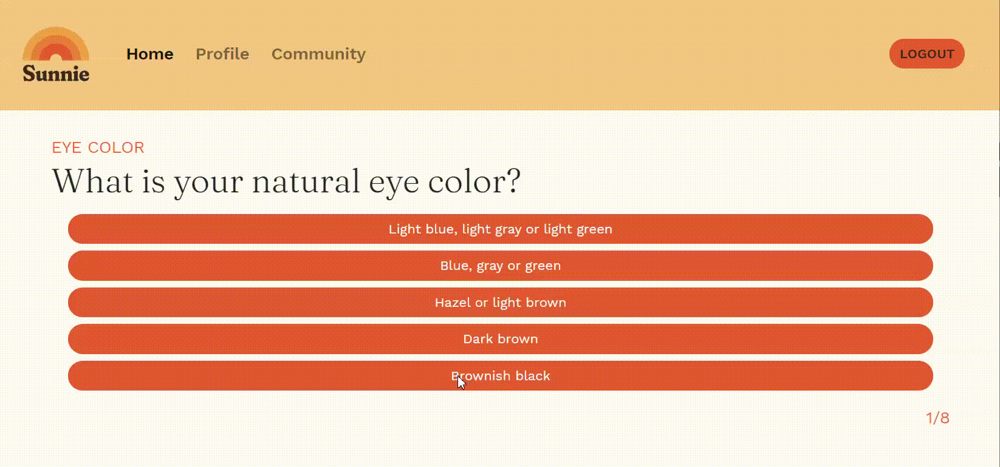
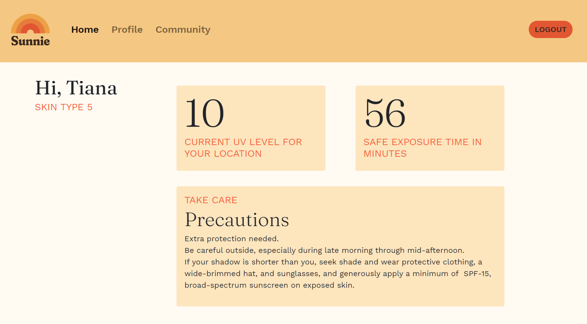
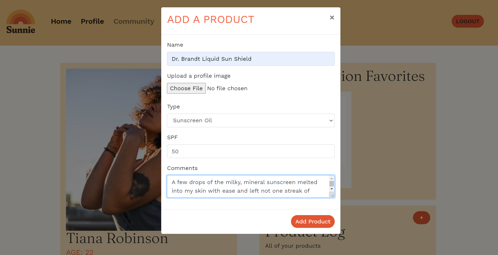
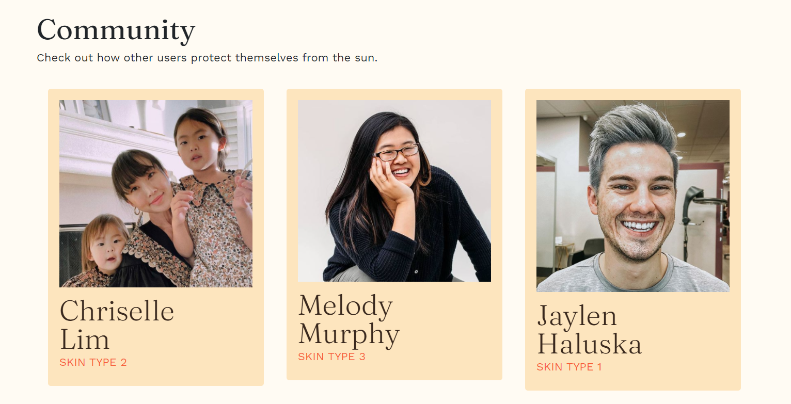
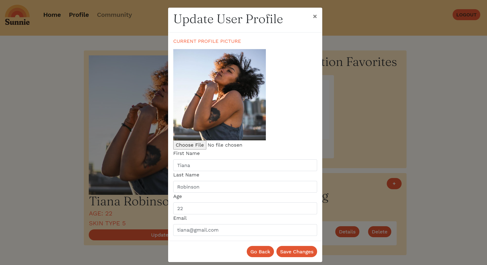

# Sunnie
Sunnie is a full stack application that helps you become more aware of how the sun affects your skin.


## Table of Contents
  * [Features](#features)
  * [Planning Documentation](#planning-documentation)
    * [Entity Relationship Diagrams](#entity-relationship-diagram)
    * [Wireframes](#wireframes)
  * [Set Up Instructions](#set-up-and-installation-instructions)

<br />

# Features
### Determine Your Skin Type

When a user registers an account with Sunnie, they will be taken to a quiz that helps determine's the user's skin type based on the Fitzpatrick Scale.


### View Your Current Location's UV Level And Current Precautions

After users are finished with the quiz, they will be redirected to the home page that displays their skin type result, current location's UV Level, and the precautions they need to take based on that UV level.

### Create, Update, and Delete Sun Protection Products From Your Profile

Users can add products to their profile by click the '+' button. It will pull up a form that the user can fill out to add their product. Users can also update and delete those products by clicked the appropriately labeled buttons.

### Favorite a Sun Protection Product

Users can favorite a product that they really love, and showcase that to the community when another user views it.

### Sunnie Community

When clicking on the community tab, users can view other people of the Sunnie community and see what favorites they have.

### Update the User Profile

Users can update their profile picture, and other details on their user profile page.

<br />

 # Planning Documentation

 ### Entity Relationship Diagram

 ### Wireframes

<br />

 # Set Up and Installation Instructions

  You will need to have command line tools installed for your computer to use terminal commands.

  Linux/ Windows users, please visit the [Git page](https://git-scm.com/book/en/v2/Getting-Started-Installing-Git) and follow the instructions for set up

  Mac users follow the instructions below

  Open your terminal and type
  ```sh
    git --version
  ```

  You will now need to configure your git account. In the terminal window, type:
  ```sh
    git config -global user.name "Your Name"
    git config -global user.email "Your Email"
  ```

  If you do not have Node.js installed on your machine, visit the [Node.js Download Page](https://nodejs.org/en/download/) and  follow the instructions. To ensure that it is installed correctly, in your terminal window, type
  ```sh
    echo $PATH
  ```
  Ensure that the result has the following in the $PATH
  ```sh
    /usr/local/bin
    or
    /usr/local/bin:/usr/bin:/bin:/usr/sbin:/sbin
  ```
  1. Pull down this repo

1. Run the script that's in the SQL folder. This will create the Sunnie database.
1. You will need to set up a Firebase account: do the follow steps in the firebase console:

   - Go to [Firebase](https://console.firebase.google.com/u/0/) and add a new project. You can name it whatever you want (Sunnie is a good name)
   - Go to the Authentication tab, click "Set up sign in method", and enable the Username and Password option.
   - Add at least two new users in firebase. Use email addresses that you find in the UserProfile table of your SQL Server database
   - Once firebase creates a UID for these users, copy the UID from firebase and update the `FirebaseId` column for the same users in your SQL Server database.
   - Click the Gear icon in the sidebar to go to Project Settings. You'll need the information on this page for the next few steps

1. Go to the `appSettings.Local.json.example` file. Replace the value for FirebaseProjectId with your own

1. Rename the `appSettings.Local.json.example` file to remove the `.example` extension. This file should now just be called `appSettings.Local.json`

1. Open your `client` directory in VsCode. Open the `.env.local.example` file and replace `__YOUR_API_KEY_HERE__` with your own firebase Web API Key

1. Rename the `.env.local.example` file to remove the `.example` extension. This file should now just be called `.env.local`

1. Install your dependencies by running `npm install` from the same directory as your `package.json` file

  Now you can follow the [installation instructions](#instructions-for-installing-Sunnie) to get Sunnie up and running on your machine.

  This project was bootstrapped with [Create React App](https://github.com/facebook/create-react-app).
